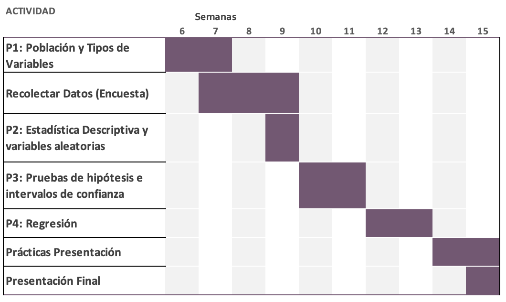

# IMPACTO DE LOS OCTÓGONOS EN EL CONSUMO DE ALIMENTOS Y BEBIDAS EN LOS ALUMNOS DE LA UNIVERSIDAD DE INGENIERÍA Y TECNOLOGÍA

## Integrantes
- Jeremy Rodrigo Guerrero Alejos
- Cristina María Calmet Gutierrez
- María José Linares Velizarof
- Tania Lisbet Meza Cruzado
- Marlyn Brenda Tasayco Castilla

## Profesora
- Brígida Coromoto Molina Carabano

## Introducción

Actualmente, por falta de una dieta balanceada y un estilo de vida insano las sociedades se han vuelto más propensas a desarrollar enfermedades del corazón, obesidad, y muertes prematuras. Una de las principales características que exponen a las personas a estas afecciones es el consumo masivo de alimentos ultraprocesados y bebidas azucaradas artificiales como por ejemplo, los helados, las gaseosas, las galletas o los snacks.
Así, con la finalidad de promover el consumo responsable de dichos productos, el 17 de junio del 2019 se promulgó la Ley N°30021, Ley de Promoción de la Alimentación Saludable para Niños, Niñas y Adolescentes, en Perú. Esta ley fue promulgada por el ex-presidente Ollanta Humala en 2013, pero fue aprobada en abril del 2017 durante el gobierno del ex-presidente Pedro Pablo Kuczynski [5]

Con la promulgación de esta norma, se llevó a cabo la implementación de octógonos de advertencia en los productos ultraprocesados y en las bebidas azucaradas. [6] El sistema de octógonos de advertencia, es un nuevo sistema de prevención contra el consumo excesivo de estos alimentos. Dado esto, los alimentos industrializados en el Perú están obligados de poner esta marca de advertencia cuando excedan los parámetros de sodio, azúcar, grasas saturadas y grasas trans. La finalidad de colocar octógonos en los envases es presentar un mensaje claro y directo que permite tomar decisiones instantáneas y sabias a la hora de comprar un producto.
Si bien esta Ley está enfocada en promover un estilo de vida saludable en niños/as y adolescentes, también influye directamente en cualquier persona que desee comprar algún alimento ultra procesado o alguna bebida azucarada artificial.


## Problemática

Con la reciente aparición de los ya mencionados octógonos, se presume que mucha gente dejó de consumir una gran variedad de productos (alimentos y bebidas) procesados, como consecuencia la advertencia que estos significan. Sin embargo, no se tienen datos precisos acerca de cuán influenciadas, a dejar de consumir un producto cuando ven los octógonos, están las personas. Por ello, a través de encuestas, las cuales se desarrollarán y analizarán durante el semestre académico 2019-II, se busca evidencia la relación existente entre la aparición de los octógonos en los productos y el consumo de los mismos por parte de los alumnos de la Universidad de Ingeniería y Tecnología.

## Objetivos

### Objetivo principal

Nuestro objetivo general es realizar un estudio que evidencie el impacto de la reciente implementación de los octógonos en el consumo de alimentos y bebidas procesados en los estudiantes de la Universidad de Ingeniería y Tecnología - UTEC.

### Objetivos especificos

1. Determinar si hay una relación entre la presupuesto diario de los entrevistados y su disposición a comprar más productos con poco valor alimenticio.
2. Determinar si hay una relación con el tiempo que cada entrevistado tiene para almorzar y el consumo de estos productos.
3. Determinar el tipo de variación de la demanda (crece/decrece) de estos productos con la aparición de los octógonos.
4. Determinar cuales son las características de la población que más han cambiado su estilo de alimentación a causa de la aparición de estos octógonos.

## Definición de la población objetivo

Para la realización de este estudio estadístico nuestra población objetivo estará centrada en los estudiantes ingresantes a la Universidad de Ingeniería y Tecnología entre los años 2016, 2017, 2018 y 2019. Del total de 1891 alumnos, que son la población total, se espera tener la muestra de al menos 50 alumnos ingresados por cada año, obteniendo así una muestra total de 200 personas.

## Preguntas de investigación 

| Numero | Pregunta                                                                                                                           | Tipo          |
|  ----- | ---------------------------------------------------------------------------------------------------------------------------------  | ------------- |
| 1      | ¿Cuál es la edad promedio de los entrevistados?                                                                                    | Descriptiva   |
| 2      | ¿Cuánto es, en promedio, el presupuesto diario, de los entrevistados, para el consumo de alimentos y bebidas (de manera general)?  | Descriptiva   |
| 3      | ¿Cuánto en promedio (al día) gastan los entrevistados en el consumo alimentos y bebidas procesadas?                                | Descriptiva   |
| 4      | ¿En qué distrito residen la mayoría de los entrevistados?                                                                          | Descriptiva   |
| 5      | ¿Existe un cambio en la tendencia de comprar ciertos productos al ver los octógonos?                                               | Exploratoria  |
| 6      | ¿Hay ciertos productos que siguen comprando los alumnos a pesar de los octógonos?                                                  | Exploratoria  |
| 7      | ¿Existe una relación entre la aceptación de la medida y su influencia en la persona?                   | Inferencial   |
| 8      | ¿Es importante observar la información nutricional de algún alimento o bebida que consumas para los alumnos de UTEC?                                             | Inferencial   |
| 9      | La mayoría de los entrevistados, ¿están a favor de la implementación de los octógonos?                                             | Inferencial   |
| 10     | ¿Es posible medir el impacto de la compra de alimentos y bebidas con octógonos sobre las empresas distribuidoras conociendo únicamente la influencia en octógonos y gasto diario de las personas en productos con octógonos?                  | Predictiva    |
| 11     | ¿Es posible saber si la demanda por los alimentos y bebidas con octógonos disminuirá o crecerá, conociendo únicamente la frecuencia de consumo de dichos productos en las máquinas de UTEC? | Predictiva   |
| 12     | ¿Cómo la implementación de los octógonos ha influenciado en el consumo de productos procesados en los entrevistados?               | Causal        |
| 13     | ¿Qué factores determinan cómo el entrevistado toma la decisión de comprar productos con octógonos?                                 | Causal        |
| 14     | ¿Cómo la presencia de octógonos varía el gasto diario promedio de los entrevistados y la frecuencia de consumo en máquinas?        | Mecanística   |
| 15     | ¿Existe una relación entre los alumnos que realizan deporte y su gasto diario en productos con octógonos?                                   | Inferencial   |

## Variables

| Variable                                                                                     | Relacion con la pregunta                   | Tipo de variable |
|  -----------------------------------------------------------------------------------------   | -----------------------------------------  | ---------------- |
| Edad| 1| Cuantitativa, discreta     |
| Presupuesto diario| 2 | Cualitativa, ordinal |
| Distrito de residencia                                                                       | 4                                          | Cualitativa, nominal      |
| Frecuencia de consumo en máquinas                                                            | 11, 14                                     | Cualitativa      |
| Grado de influencia de los octógonos en el consumo de alimentos y bebidas procesados         | 5, 6, 7, 8,10, 12, 13,14                  | Cualitativa      |
| Grado de importancia de la información nutricional                                           | 9                                          | Cualitativa      |
| Número de entrevistados a favor de la implementación de los octógonos                        | 9                                          | Cuantitativa     |
| Número de entrevistados en contra de la implementación de los octógonos                      | 9                                          | Cuantitativa     |
| Número de entrevistados a los que les es indiferente la implementación de los octógonos      | 9                                          | Cuantitativa     |
| Gasto diario en alimentos                                                                    | 3, 14                                  | Cuantitativa     |
| Gasto diario en productos con octógonos                                                                    | 3, 13, 15                                  | Cuantitativa     |


## Metodología

Se realizará una encuesta virtual de aproximadamente 20 preguntas. Se incluirán preguntas demográficas, abiertas, cerradas, de clasificación  y de opción múltiple.  

## Acceso a variables muestrales

Encuesta virtual a través de Google Forms, para los estudiantes de UTEC que hayan ingresado a la universidad entre los años 2016-2019. Para ello, se coordinará con Servicios Educativos para que ellos puedan hacer llegar la encuesta a través del portal de mensajería Gmail de la universidad. Asimismo, esta encuesta también se hará llegar a los alumnos a través del grupo cerrado con el nombre de Comunidad de alumnos UTEC en la red social Facebook.

## Cronograma



A partir de la encuesta realizada en toda la universidad a través de un google forms. Pudimos recolectar la siguiente información:

```{r}
library(readr)
library(ggplot2)
```

```{r}
DF<-read_csv(file="DatosE2.csv")
```


## Respondiendo las preguntas descriptivas

### ¿Cuál es la edad promedio de los entrevistados?

```{r}
Edades<-DF$Edad

round(mean(Edades),2)
median(Edades)
getmode <- function(v) {
   uniqv <- unique(v)
   uniqv[which.max(tabulate(match(v, uniqv)))]
}
getmode(DF$Edad)
```

```{r}
boxplot(Edades, ylab="Edad (Años)",prob=TRUE,col = "lightblue", pch=20,main="Edades de los entrevistados",ylim=c(15,28),boxwex = 1)
abline(h=mean(Edades),col="red",lwd=2)
legend(1.15,24,legend=c("media de edades","mediana de edades"),col=c("red","black"),lwd=2)
```

> Según los datos de la encuesta, la edad media de los entrevistados es de 19 años al igual que la moda y la mediana.

### ¿Cuánto es, en promedio, el presupuesto diario de los entrevistados para el consumo de alimentos y bebidas (de manera general)?

```{r}
PresupuestoDiario<-DF$`Presupuesto diario para alimentos`
```

```{r}
table(PresupuestoDiario)
barplot(table(PresupuestoDiario),xlab="Presupuesto Diario", ylab="Frecuencia",main="Presupuesto diario para el consumo de alimentos", col="lightgreen",ylim = c(0,200),xlim = c(0,8), las=1, cex.names=0.8, names.arg = NULL)
abline(v=median(DF$`Presupuesto diario para alimentos`),col="red",lwd=2)
abline(v=mean(DF$`Presupuesto diario para alimentos`),col="blue",lwd=2)
```

> Dentro del histograma que hemos desarrollado con los datos obtenidos hemos encontrado que es de tipo bimodal. Donde la mayor frecuencia se encuentra tanto en un presupuesto de 5-10 y 10-20 soles. 

### ¿Cuánto en promedio (al día) gastan los entrevistados en el consumo alimentos y bebidas procesadas?


```{r}
GastoDiario<-DF$`Gasto diario en productos con octógonos`

round(mean(GastoDiario),2)
median(GastoDiario)
getmode <- function(v) {
   uniqv <- unique(v)
   uniqv[which.max(tabulate(match(v, uniqv)))]
}
getmode(DF$`Gasto diario en productos con octógonos`)
```

```{r}
boxplot(GastoDiario, ylab="Gasto Diario (Soles)",prob=TRUE,col = "lightblue", pch=20,main="Gasto diario en productos procesados",ylim=c(0,25),boxwex = 1)
abline(h=mean(GastoDiario),col="red",lwd=2)
legend(1.09,24,legend=c("media de gasto diario","mediana de gasto diario"),col=c("red","black"),lwd=2)
```

> De la encuesta logramos encontrar que la mediana del gasto se encuentra en 2 soles.

### ¿En qué distrito residen la mayoría de los entrevistados?

```{r}
Distrito<-DF$Distrito
table(Distrito)
```

> La mayoría de los entrevistados son de Santiago de Surco.

## Respondiendo Preguntas Exploratorias

### ¿Hay productos que siguen comprando los alumnos a pesar de los octógonos?

```{r}
Influencia<-DF$`Influencia de los octógonos (1-10)`
```

```{r}

table(Influencia)
barplot(table(Influencia),xlab="Grado de Influencia",col="lightgreen", ylab="Frecuencia",main="Grado de influencia de los octógonos", ylim = c(0,100),xlim = c(0,12), las=1)
abline(v=median(DF$`Influencia de los octógonos (1-10)`),col="black",lwd=2)
abline(v=mean(DF$`Influencia de los octógonos (1-10)`),col="red",lwd=2)
legend(1.1,95, legend=c("1=No influye","10=Sí influye"))
legend(5.8,95,legend=c("media de grado de influencia","mediana de grado de influencia"),col=c("red","black"),lwd=2)
```

La forma de este histograma es asimétrico, pero al observar la frecuencia podemos concluir que la mayoría de las personas tiene una influencia de grado 5 a más, esto implicaría que a calado medianamente los octógonos dentro de la conciencia de las personas.


### ¿Existe un cambio en la tendencia de comprar ciertos productos al ver los octógonos?

```{r}
FrecuenciaSemanal<-DF$`Frecuencia de compras de las máquina de la UTEC (semanal)`
```

```{r}
plot(jitter(Influencia),jitter(FrecuenciaSemanal)
     ,main="Diagrama de dispersión de Grado de Influencia vs Frecuencia Semanal \n de compras en las máquinas " 
     ,xlab="Grado de Influencia"
     ,ylab="Frecuencia Semanal"
     ,ylim = c(0,7)
     )
```

No pudimos encontrar una tendencia exacta entre el grado de influencia de los octógonos y la frecuencia de compra de las personas.

## Respondiendo las preguntas inferenciales

### ¿Es importante observar la información nutricional de algún alimento o bebida que consuman para los alumnos de UTEC?

```{r}
table(DF$`Importante la información nurticional`)
```
De la encueta se oberva que hay un 72.06% de entrevistados que les parece importante observar la información nutricional y hay un 27.94% de entrevistados que no les parece importante observar la información nutricional.

H0: 72.06% de la población total no les parece importante observar la información nutricional </p>
H1: 72.06% de la población total si les parece es importante observar la información nutricional

```{r}
prop.test(294,408, alternative = "two.sided", conf.level=0.90)
```
Como el p-value es menor a nuestro a 0.05, no se acepta H0, por ende se concluye que el que al 72.06% de los estudiantes de UTEC sí les parece importante observar la información nutricional.

### La mayoría de los estudiantes de UTEC, ¿están a favor de la implementación de los octógonos?


```{r}
table(DF$`A favor de los octógonos`)
```
De la encueta se oberva que hay un 79.4% de entrevistados están a favor de la implementación de los octógnos.

H0: 79.4% de la población total no están a favor de la implementación de los octógonos </p>
H1: 79.4% de la población total sí están a favor de la implementación de los octógonos

```{r}
prop.test(324,408,alternative = "two.sided", conf.level=0.90)
```
Como el p-value es menor a nuestro a 0.05, no se acepta H0, por ende se concluye que el que al 79.4% de los estudiantes de UTEC sí están a favor de la implementación de los octógonos.

### ¿Existe una relación entre la aceptación de la presencia de octógonos y su influencia en la persona?

Se hizo un dataframe compuesto por las personas que dijeron que sí están a favor de los octógonos.
```{r}
infl<-mean(DF$`Influencia de los octógonos (1-10)`)
infl
Aceptar<-DF[which(DF$`A favor de los octógonos`== "Sí"),]
summary(Aceptar$`Influencia de los octógonos (1-10)`)
```

Se encontró que la media del grado de influencia general es de 5.1764. Lo que deseamos comparar es si es que la media de la influencia de las personas que aceptan los octogonos es mayor que la media general de influencia.

H0: u <= 5.176471 </p>
H1: u > 5.176471

```{r}
t.test(Aceptar$`Influencia de los octógonos (1-10)`,mu=5.176471,alternative = "greater",conf.level = 0.90)
```
Como el p-value es menor a nuestro alfa, no se acepta H0 y se concluye que para las personas que aceptan la medida de los octogonos estos tienen una mayor influencia al momento de consumir estos productos.

La existencia de una relación entre la aceptación de la presencia de octógonos y su influencia en la persona se puede ser gráficada con el grado de influencia vs en gasto diario en productos con octógonos.
```{r}
ge <- lm(Influencia~GastoDiario, DF)
plot(jitter(Influencia),jitter(GastoDiario)
     ,main="Diagrama de dispersión de Grado de Influencia vs Gasto Diario \n en productos con octógonos " 
     ,xlab="Grado de Influecnia"
     ,ylab="Gasto Diario"
     ,ylim = c(0,9)
     )
abline(ge,col = "Blue")

```
La gráfica muestra que hay una tendencia entre grado de influencia y el gasto diario en productos con octógonos, a menor es el grado de influencia, mayor el es gasto diario.

### ¿Existe una relación entre los alumnos que realizan deporte y su gasto en productos con octógonos?

Se hizo un dataframe compuesto por las personas que dijeron que sí realizan deporte.
```{r}
NoDeporte<-DF[which(DF$`Realiza Deporte` == "No"),]
Deporte<-DF[which(DF$`Realiza Deporte` == "Sí"),]
metotal<-mean(DF$`Gasto diario en productos con octógonos`)
metotal
summary(Deporte$`Gasto diario en productos con octógonos`)
summary(NoDeporte$`Gasto diario en productos con octógonos`)
```
Se encontró que la media del gasto diario de toda la población es 3.7647

Esta pregunta la vamos a desarrollar en 2 partes:

1. Consumo de los deportistas

H0: media de los deportistas >= media total ->> u>=3.7647 </p> 
 
H1: u < 3.7647

```{r}
t.test(Deporte$`Gasto diario en productos con octógonos`,mu=3.7647,alternative = "less",conf.level = 0.9)
```
Como el p-value es menor a nuestro alfa, no se acepta H0 y se concluye que los estudiantes que realizan deportes consumen menos productos con octogonos.

2. Consumo de los No Deportistas

H0: media de los no deportistas >= media total ->> u>=3.7647 </p> 
 
H1: u < 3.7647

```{r}
t.test(NoDeporte$`Gasto diario en productos con octógonos`,mu=3.7647,alternative = "less",conf.level = 0.9)
```
Como el p-value es mayor a nuestro alfa, se acepta H0 y se concluye que los estudiantes que no realizan deporte consumen más productos con octogonos.

```{r}
plot.function(x = function(t) dnorm(x = t, mean(Deporte$`Gasto diario en productos con octógonos`), sd(Deporte$`Gasto diario en productos con octógonos`)),
              from = -20,
              to = 30,
              col = "red",
              xlab = "Gasto Diario en productos con octógonos (Soles)",
              ylab = "Densidad",
              main = "Distribución Normal")
plot.function(x = function(t) dnorm(x = t, mean(NoDeporte$`Gasto diario en productos con octógonos`), sd(NoDeporte$`Gasto diario en productos con octógonos`)),
              from = -20,
              to = 30,
              col = "blue",
              add = TRUE)
plot.function(x=function(t) dnorm(x=t, mean(DF$`Gasto diario en productos con octógonos`), sd(DF$`Gasto diario en productos con octógonos`)),
              from = -20,
              to = 30,
              col = "green",
              add = TRUE)
legend(x = "topright",
       legend = c("Deporte","No Deporte","Total"),
       col = c("red", "blue","green"),
       lty = 1)
abline(v=mean(DF$`Gasto diario en productos con octógonos`),col="green",lwd=1)
abline(v=mean(Deporte$`Gasto diario en productos con octógonos`),col="red",lwd=1)
abline(v=mean(NoDeporte$`Gasto diario en productos con octógonos`),col="blue",lwd=1)
text(-10,0.12, expression("Lineas verticales = media"))
```
La distribución normal de Deporte es más angosto que la distribución normal del total de entrevistados, y más angosto que la distribución normal de los de No Deporte. Esto indica que la variación estándar es mayor de los de No Deporte lo que implica que hay más rango de gastos diario en productos con octógonos que la distribución normal de los de Deporte.

## Respondiendo preguntas Predictivas

### ¿Es posible medir el impacto de la compra de alimentos y bebidas con octógonos sobre las empresas distribuidoras conociendo únicamente la influencia en octógonos y gasto diario de las personas en productos con octógonos?

H0: coeficiente de correlación es igual a 0
H1: coefiiente de correlacion es mayor a 0

```{r}

NF<-lm(DF$`Influencia de los octógonos (1-10)`~DF$`Gasto diario en productos con octógonos`)
summary(NF)
```
```{r}
plot(DF$`Influencia de los octógonos (1-10)`~DF$`Gasto diario en productos con octógonos`,type="p",xlab="Gasto diario en productos con octógonos (soles)",ylab="Influencia de los octógonos",ylim=c(1,10), xlim=c(0,22), main="Diagrama de correlación entre Gasto diario e \n influencia de los octógonos" )
abline(NF,col="red")
```
```{r}
t.test(NF$coefficients)
```
El gráfico presenta que no hay una relación entre las variables. El pequeño valor de R cuadrado nos dice que no es una regresión buena, y el análisis de T Student lo confirma. La regresión y la relación entre ambas variables no es significativa; y no nos puede decir nada sobre la predicción de la compra de alimentos y bebidas con octógonos sobre las empresas distribuidoras.
Nuestro nivel de confianza es de 95%, encontramos que el p value es mayor a 0.05 por lo que aceptamos la hipótesis nula, es decir el coeficiente de correlacion es igual a 0.

### Regresión Multiple entre la edad, Gasto Diario

H0: coeficiente de correlación es igual a 0
H1: coefiiente de correlacion es mayor a 0

```{r}
m2 <- lm(GastoDiario~Edades + FrecuenciaSemanal + Influencia, data=DF)
summary(m2)
plot(DF[c(2,8,13,14)])
```
Viendo el gráfico de regresión múltiple, podemos decir que no hay ninguna relación entre las variables Edad, Gasto diario en productos con octógonos, Frecuencia de compras en UTEC e Influencia de octógonos.
Asimismo, el R cuadrado es muy cercano a 0.

## Respondiendo las preguntas causales

### ¿Cómo la implementación de los octógonos ha influenciado en el consumo de productos procesados en los entrevistados?

Según una noticia publicada por el diario online gestión.pe el consumo de gaseosas, yogurt y galletas es el que más cayó por la presencia de los octógonos.<br>
Esta noticia indica que las familias disminuyeron consumo de alimentos con octógonos en 4% en julio (2019) y que además, las advertencias alto en azúcar y en grasas saturadas son las de mayor impacto negativo en consumo de hogares.[1]<br>
Refiere también, que según un estudio de la división Worldpanel de la consultora Kantar en julio de este año, con respecto al mismo periodo del 2018, el consumo de las marcas con octógonos en supermercados cayó 4%, más del doble que en el canal tradicional ( bodegas y mercados). Dicha caída se dio principalmente, por el menor consumo de productos considerados principales como cereales listos, galletas, helados, panetón, sopas y cremas, gaseosas, néctares, yogurt, embutidos y refrescos líquidos, que cayeron 10%.<br>
En el caso de las gaseosas, en julio se redujo su frecuencia de compra en 6% y galletas lo hizo en 7%. Mientras que yogurt disminuyó en 27%.<br>
Francisco Luna, country manager de la consultora, explica que “esto se debería a que los consumidores no esperaban que estos productos tengan advertencias, y ante esto disminuyeron su frecuencia de compra, o dejaron de adquirirlos”. <br>
Entonces, se puede concluir que la presencia de los octógonos en productos procesados ha tenido un impacto negativo en el consumo de productos procesados, ya que según el estudio de la división Worldpanel de la consultora Kantar, el consumo de algunos ejemplares de estos se ha visto mermada desde la aparición de estos octógonos hasta aproximadamente el mes de julio que fue cuando se realizó el estudio.<br>

### ¿Qué factores determinan cómo el entrevistado toma la decisión de comprar productos con octógonos?

Para poder responder a la pregunta tendríamos que analizar el **comportamiento del consumidor**, pero primero definamos ¿qué es el  comportamiento de un consumidor?. El comportamiento de un consumidor es la observación y estudio de los procesos mentales y psicológicos que suceden en la mente de un comprador cuando éste elige un producto y no otro, con la finalidad de comprender el motivo por el que sucede de esa manera.[2]
La nota indica que el consumidor antes de tomar la decisión sobre un producto, primero identifica y selecciona un producto que vaya a satisfacer su necesidad, luego de eso estima la cantidad que estaría dispuesto a pagar por dicho producto y justo antes de comprar analiza la gama de precios y ofertas que puede seleccionar antes de elegir lo que comprará. Sin embargo, el precio no es el único factor que influye en la elección de los consumidores, pues según la página web del diario GESTIÓN, existen 6 principales factores que influyen en el comportamiento de un consumidor. Estos factores son los siguientes: <br>
**La cultura**: Es el modo de vida de una comunidad o grupo. Con el fin de encajar en un grupo cultural, un consumidor debe seguir las normas culturales que se encuentran formalmente manifiestas y aquellas que son tácitas.
El estilo de vida: La influencia del estilo de vida en el comportamiento del consumidor determina sin mediación el hecho de que si la persona tiene menores ingresos que otras, no tendrá acceso a ciertos productos y servicios que se encuentran por encima de su escala socioeconómica.  <br>
**La motivación**: Esta es la variable que impulsa a una persona a considerar una necesidad más importante que otra.  En congruencia con ello, la necesidad más importante exige ser satisfecha en primer lugar. La motivación es una dinámica compleja alimentada por diferentes necesidades de naturaleza fisiológica, biológica y social.<br>
**La personalidad**: La personalidad es un conjunto de variables que están profundamente engastados en la mente de una persona. La personalidad difiere de persona a persona, ciertos casos de forma notable, y también se ve influenciada por factores externos como el lugar en que se encuentra la persona o la hora del día. La personalidad determina lo que uno comerá, va a vestir, lo que va a estudiar, con lo que se aseará y lo que mirará en los puntos de venta. <br>
**La edad**: Este favor influye en el comportamiento de los consumidores de una manera bastante directa. las necesidades de los consumidores son básicas en la infancia pero se tornan más complejas en la adolescencia y juventud. Este proceso continúa su articulación conforme avanza la edad del individuo. Las necesidades psicológicas de las personas en diferentes grupos etarios difieren unas de otras, motivo que explica los cambios en el comportamiento del consumidor con el paso del tiempo.<br>
**La percepción**: La percepción es la opinión prevaleciente popular acerca de un producto o servicio en un momento determinado. Al ser un constructo mental fuertemente subjetivo, los consumidores pueden tener la misma necesidad, pero comprar marcas totalmente distintas debido a su sistema perceptual. La percepción es una variable influenciada por estímulos externos como los comentarios de otras personas o las comunicaciones de marketing, sean publicitarias o de relaciones públicas. Estos factores participan en el proceso de moldear la percepción y sistema de creencias y actitudes de las personas referidas a las marcas.<br>

## Respondiendo la pregunta mecanística

### ¿Cómo la presencia de octógonos varía el gasto diario promedio de los entrevistados y la frecuencia de consumo en máquinas?

Según el reporte periodistico encontrado en la pagina de gestión.pe el consumo de productos que contienen estos octógonos debería bajar de manera significativa. Esto se traduciría como un menor gasto diario promedio y un menor consumo en las máquinas expendedoras. Pero ,dentro de una entrevista realizada al Grupo Mayo (empresa líder en marketing de marcas dentro del Perú), indica lo contrario. Él expresa que si bien los octógonos tienen el trabajo principal de informar a los consumidores del contenido de los productos alimentarios. Esto no necesariamente se tiene que traducir en un impacto hacia el consumo de estos. Luego hace un ejemplo sobre el consumo de cigarrillos los cuales tienen advertencias muy claras en su empaque desde hace mucho tiempo, pero eso no a disminuido sus ventas. Él declaró: “Considero que la imagen de una lovemark sí se pone en ventaja frente a un comodity”. Al observar la información encontrada en el grado de influencia presentado en el gráfico de barras, podemos encontrar que hay una moda en el grado 1. Pero al notar la línea que indica  la media y la mediana se puede identificar que está en el centro. Finalmente, podemos concluir que ambos testimonios (la entrevista al Grupo Mayo como el reportaje de Gestión) están en lo correcto. Hay un porcentaje de la población a la cual no le influye en lo más mínimo estos octógonos y también hay otra que le influye en una medida lo suficientemente considerable como para evitar el consumo de ciertos productos.[3]

## Conclusiones

Entonces, se puede concluir que la presencia de los octógonos en productos procesados ha tenido un impacto negativo en el consumo estos productos, ya que según el estudio de la división Worldpanel de la consultora Kantar, el consumo de algunos ejemplares de dichos productos se ha visto mermada, desde la aparición de los octógonos hasta aproximadamente el mes de julio que fue cuando se realizó el estudio. 
Sin embargo, el estudio estadístico realizado sobre el "impacto de la presencia de los octógonos en los productos procesados", contradice esta conclusión  ya que para una población de alumnos de UTEC, donde pudimos observar, según el estudio, que no existe una relación entre la implementación de los octógonos y la frecuencia de consumo de los entrevistados, ni tampoco entre el grado de influencia de los octógonos y su gasto diario en los ya mencionados productos.
Además, no se logró establecer una relación entre el tiempo que tienen los entrevistados para almorzar y su consumo de productos con octógonos. 
Asimismo, concluimos que no se puede determinar la variación de la demanda de los productos con octógonos, ya que la información analizada corresponde únicamente a una pequeña muestra de la población y no logramos obtener la información del flujo de productos de la empresa abastecedora a las máquinas expededoras de estos productos.
Finalmente, de acuerdo a nuestra investigación, se pueden plantear nuevas preguntas para conseguir más datos sobre la influencia de los octógonos en los estudiantes de UTEC y se proyecta expandir este estudio estadístico a una población de estudiantes universitarios en la región Lima y/o a nivel de Perú.

## Bibliografía

1. Gestión. (2019, 13 septiembre). Consumo de gaseosas,yogur y galletas es el que más cae por octógonos. Recuperado 15 noviembre de 2019 de https://gestion.pe/economia/empresas/consumo-de-gaseosasyogur-y-galletas-es-el-que-mas-cae-por-octogonos-noticia/?ref=gesr
2. Gestión. (s.f.). 6 factores que influyen el comportamiento del consumidor | Blogs | Gestión. Recuperado 15 noviembre de 2019 de https://gestion.pe/blog/marcasymentes/2013/01/6-factores-que-influyen-el-com.html/?ref=gesr
3. RPP NOTICIAS. (2019, 16 septiembre). Ley de alimentación saludable: ¿Los octógonos condicionan la decisión de compra? Recuperado 15 noviembre de 2019 de (https://vital.rpp.pe/comer-bien/ley-de-alimentacion-saludable-los-octogonos-condicionan-la-decision-de-compra-noticia-1219811)
4. El Comercio. (s.f.). 6 factores que influyen el comportamiento del consumidor | Blogs | Gestión. Recuperado 15 noviembre de 2019 de 
https://elcomercio.pe/tecnologia/ciencias/octogonos-advertencia-peru-obesidad-salud-noticia-646034-noticia/ 

5. El Peruano. (2013, 17 mayo). Normas legales. Recuperado 15 de noviembre de 2019 de 
https://cdn.www.gob.pe/uploads/document/file/105196/_30021_-_20-05-2013_09_11_14_-Ley_N__30021.pdf

6. El Comercio. (2019, 16 julio). Octógonos de advertencia | ¿Qué son y por qué su uso empezó a ser obligatorio desde junio? Recuperado 15 noviembre de 2019 de https://elcomercio.pe/tecnologia/ciencias/octogonos-advertencia-obligatorios-caracteristicas-ley-alimentacion-saludable-peru-noticia-610351 
